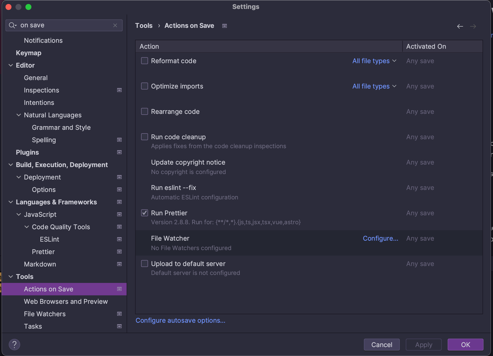
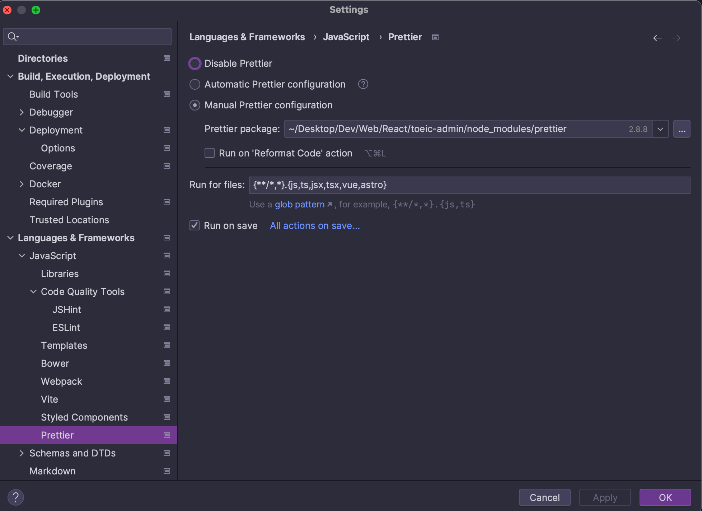

# Getting Started with Create React App
## Add prettier
```shell
yarn add -D eslint-config-prettier eslint-plugin-prettier prettier
```
- https://github.com/pnlinh-it/react-tiny-mce/commit/ff995627a8d806bd19581a84497386923be03c64

Add `Actions on Save` configuration

|                           |                           |
|---------------------------|---------------------------|
|  |  |

## Add tiny-mce
There two ways:
- Using pre-build bundle by specify attribute `tinymceScriptSrc={process.env.PUBLIC_URL + '/tinymce/tinymce.min.js'}`
  - https://www.tiny.cloud/docs/tinymce/6/react-pm-host/
- Build your own bundle from source
  - https://www.tiny.cloud/docs/tinymce/6/react-pm-bundle/

### Using pre-build bundle
```shell
yarn add tinymce @tinymce/tinymce-react
yarn add -D fs-extra
```
Setup a `postinstall` script to copy TinyMCE to the public directory for hosting

That script will copy all required file into `public/tinymce` directory.

When we run `npm run build` to build production bundle, all file and directory from `public` directory will copy to `build` directory.
`postinstall.js`
```js
const fse = require('fs-extra');
const fe = require('fs');
const path = require('path');
const topDir = __dirname;
fse.emptyDirSync(path.join(topDir, 'public', 'tinymce'));
fse.copySync(path.join(topDir, 'node_modules', 'tinymce'), path.join(topDir, 'public', 'tinymce'), {
  overwrite: true,
  // Only copy *.min.{css,js} file
  filter: (file) =>
          fe.lstatSync(file).isDirectory() || file.endsWith('.min.js') || file.endsWith('.min.css'),
});
```

Update `.gitignore`

```gitignore
/public/tinymce/
```

```shell
npm run postinstall
```

```typescript jsx
import React, { useRef } from 'react';
import './App.css';

import { Editor } from '@tinymce/tinymce-react';
import { Editor as TinyMCEEditor } from 'tinymce';

function App() {
  const editorRef = useRef<TinyMCEEditor | null>(null);
  return (
    <div className="App">
      <Editor
        onInit={(evt, editor) => (editorRef.current = editor)}
        initialValue="Inital value"
        tinymceScriptSrc={`${process.env.PUBLIC_URL}/tinymce/tinymce.min.js`}
        init={{
          lists_indent_on_tab: true,
          placeholder: 'Empty',
          branding: false,
          plugins: [
            'advlist',
            'autolink',
            'lists',
            'link',
            'image',
            'charmap',
            'preview',
            'anchor',
            'searchreplace',
            'visualblocks',
            'code',
            'fullscreen',
            'insertdatetime',
            'media',
            'table',
            'help',
            'wordcount',
          ],
          toolbar:
            'undo redo | blocks | ' +
            'bold italic backcolor | alignleft aligncenter ' +
            'alignright alignjustify | bullist numlist outdent indent | ' +
            'removeformat | code help',
          inline: false,
          menubar: false,
          newline_behavior: 'linebreak',
        }}
        onChange={(event, editor) => {
          console.log(editor.getContent());
        }}
        onBlur={(event, editor) => {
          if (editor.isDirty()) {
            console.log('loading...');

            setTimeout(() => {
              console.log('done');
              editor.save();
            }, 1000);
          }
        }}
      />
    </div>
  );
}

export default App;
```

### Build your own bundle from source
```shell
yarn add tinymce @tinymce/tinymce-react
yarn add -D raw-loader
```
`BundledEditor.js`
```js
import { Editor } from '@tinymce/tinymce-react';

// TinyMCE so the global var exists
// eslint-disable-next-line no-unused-vars
import tinymce from 'tinymce/tinymce';
// DOM model
import 'tinymce/models/dom/model';
// Theme
import 'tinymce/themes/silver';
// Toolbar icons
import 'tinymce/icons/default';
// Editor styles
import 'tinymce/skins/ui/oxide/skin.min.css';

// importing the plugin js.
// if you use a plugin that is not listed here the editor will fail to load
import 'tinymce/plugins/advlist';
import 'tinymce/plugins/anchor';
import 'tinymce/plugins/autolink';
import 'tinymce/plugins/autoresize';
import 'tinymce/plugins/autosave';
import 'tinymce/plugins/charmap';
import 'tinymce/plugins/code';
import 'tinymce/plugins/codesample';
import 'tinymce/plugins/directionality';
import 'tinymce/plugins/emoticons';
import 'tinymce/plugins/fullscreen';
import 'tinymce/plugins/help';
import 'tinymce/plugins/help/js/i18n/keynav/en';
import 'tinymce/plugins/image';
import 'tinymce/plugins/importcss';
import 'tinymce/plugins/insertdatetime';
import 'tinymce/plugins/link';
import 'tinymce/plugins/lists';
import 'tinymce/plugins/media';
import 'tinymce/plugins/nonbreaking';
import 'tinymce/plugins/pagebreak';
import 'tinymce/plugins/preview';
import 'tinymce/plugins/quickbars';
import 'tinymce/plugins/save';
import 'tinymce/plugins/searchreplace';
import 'tinymce/plugins/table';
import 'tinymce/plugins/template';
import 'tinymce/plugins/visualblocks';
import 'tinymce/plugins/visualchars';
import 'tinymce/plugins/wordcount';

// importing plugin resources
import 'tinymce/plugins/emoticons/js/emojis';

// Content styles, including inline UI like fake cursors
/* eslint import/no-webpack-loader-syntax: off */
import contentCss from '!!raw-loader!tinymce/skins/content/default/content.min.css';
import contentUiCss from '!!raw-loader!tinymce/skins/ui/oxide/content.min.css';

export function BundledEditor(props) {
  const { init, ...rest } = props;
  // note that skin and content_css is disabled to avoid the normal
  // loading process and is instead loaded as a string via content_style
  return (
    <Editor
      init={{
        ...init,
        skin: false,
        content_css: false,
        content_style: [contentCss, contentUiCss, init.content_style || ''].join('\n'),
      }}
      {...rest}
    />
  );
}
```
```typescript jsx
import React, { useRef } from 'react';
import { BundledEditor } from './BundledEditor';
import { Editor as TinyMCEEditor } from 'tinymce';

export function UsingBundleEditor() {
  const editorRef = useRef<TinyMCEEditor | null>(null);
  const log = () => {
    if (editorRef.current) {
      console.log(editorRef.current.getContent());
    }
  };
  return (
    <>
      <BundledEditor
        onInit={(evt: never, editor: TinyMCEEditor) => (editorRef.current = editor)}
        initialValue="<p>This is the initial content of the editor.</p>"
        init={{
          height: 500,
          menubar: false,
          plugins: [
            'advlist',
            'autolink',
            'lists',
            'link',
            'image',
            'charmap',
            'preview',
            'anchor',
            'searchreplace',
            'visualblocks',
            'code',
            'fullscreen',
            'insertdatetime',
            'media',
            'table',
            'help',
            'wordcount',
          ],
          toolbar:
            'undo redo | blocks | ' +
            'bold italic backcolor | alignleft aligncenter ' +
            'alignright alignjustify | bullist numlist outdent indent | ' +
            'removeformat | code help',
          content_style: 'body { font-family:Helvetica,Arial,sans-serif; font-size:14px }',
        }}
      />
      <button onClick={log}>Log editor content</button>
    </>
  );
}
```

## Error
```
Unexpected token '<'
SyntaxError: Unexpected token '<'
ERROR
Script at URL "http://localhost:3000/tinymce/plugins/help/js/i18n/keynav/en.js" did not call `tinymce.Resource.add('tinymce.html-i18n.help-keynav.en', data)` within 1 second
    at handleError (http://localhost:3000/static/js/bundle.js:41080:58)
    at http://localhost:3000/static/js/bundle.js:41103:7
```

Make sure required plugins in config `init.plugins` are existing in `public/tinymce/plugins`
